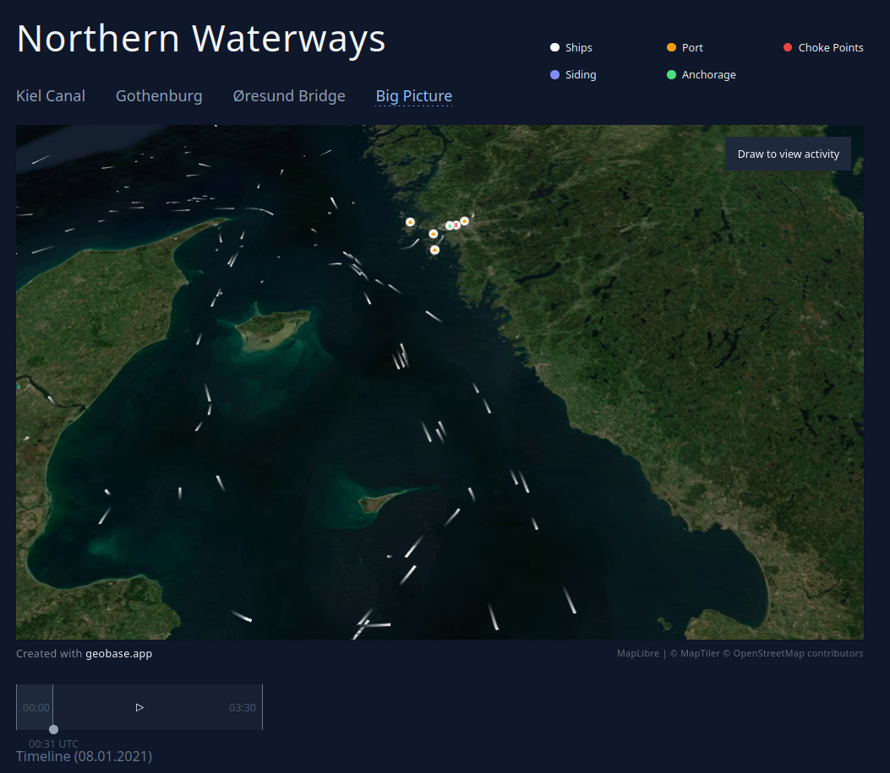
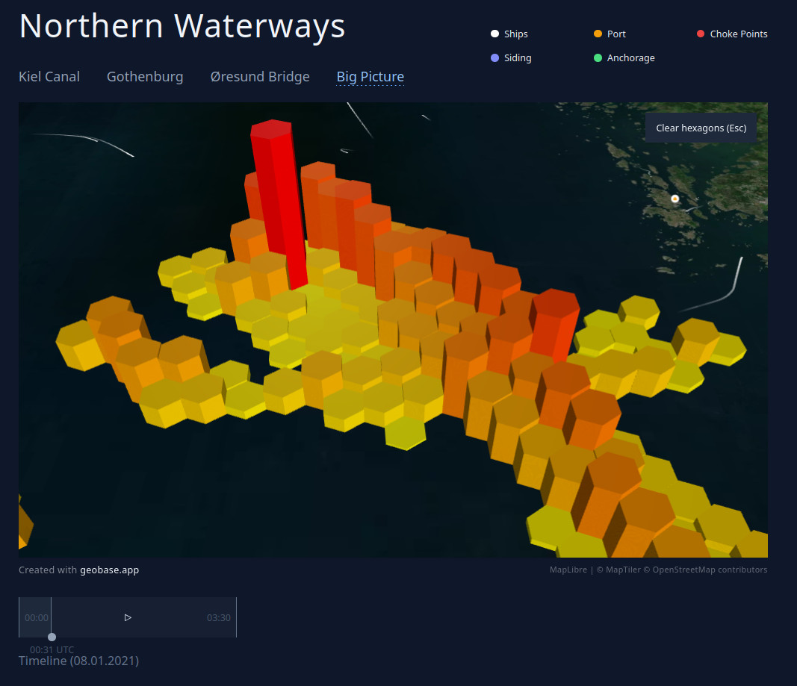
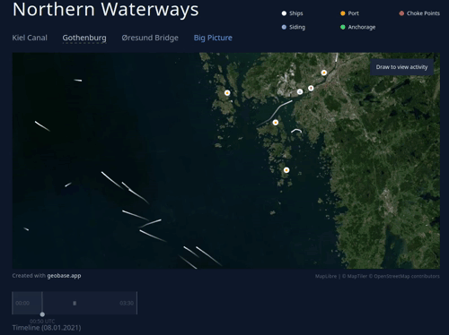
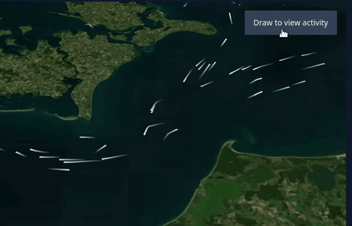

# Blueprint: Ship Movement Analysis (Next.js)

 A Geobase quickstart blueprint application showing animated ship trails. 

 <picture>
  
</picture>

 <picture>
  
</picture>

## Outline

1. [What's included](#whats-included)
2. [Prerequisites](#prerequisites)
3. [Development](#development)
     1. [Migration](#migration)
4. [Deployment](#deployment)
5. [Video](#video)
6. [Further Info](#further-info)
7. [Adapting](#adapting)

## What's included

This is a Next.JS React and Geobase application that shows animated ship movements on a map. It uses the powerful PostgreSQL extensions MobilityDb, H3 and PostGIS built into Geobase. The application can also interactively query the data to calculate aggregate statistics.  Using Geobase, with very minimal editing, a user can quickly get started loading, processing and viewing dynamic temportal geospatial data. 

AIS stands for Automatic Identification System. It is the location tracking system for sea vessels. It's like GPS but with lots of other additional data fields. There is a dataset already uploaded to Geobase ready for this quickstart. This quickstart imports, processes and makes available the data as temporal vector tiles. The vector tiles are then displayed using Deck.gl on a Maplibre map. The user can draw a polygon on the map and results in hexagons showing data about how much ship activities there are in each area.   

## Prerequisites

The first step is to have an account on [Geobase](https://geobase.app/) and to create a new project.

Basic familiarity with Node or running Next.js applications (e.g. via nvm and using npm)

Once you're Geobase project is created, you can manually download, clone or create a new GitHub repository using this template by [clicking here](https://github.com/new?template_name=geobase-blueprint-ship-movement&template_owner=decision-labs). This will create a copy of this repo without the git history.

## Development

### Migration

First you will need to load and process the data for the application.  You can run SQL from within the Geobase application, or you connect from your own. Geobase has uploaded a sample of AIS shipping data in CSV format from 2021 for you to get going quickly.

#### Option 1: Quickstart via the studio

1. Go to the studio
2. Navigate to the SQL Editor page
3. Click on Geobase Quickstarts
4. Select Ship Movement Analysis
4. Click Run.

See the video below for a quick walkthrough on choosing the quickstart.

<video src="https://github.com/user-attachments/assets/66753afc-2e2e-4a4b-9760-2c8f8225be6f" ></video>


#### Option 2: Using `psql` version compatible with your Geobase project (postgres 14 or 15)

Locally if you have the postgresql client binaries installed, you can use psql to connect to Postgres on your Geobase server and load in the SQL file.  

Set the database uri in your environment, you can get it from the geobase project settings page:


```sh
# set the database uri in your environment
DATABASE_URI=<your-database-uri>
psql -d $DATABASE_URI -f geobase/geobase-ship-movement.sql
```


### Environment Variables

You only need to have these variables set:

```
VITE_GEOBASE_URL=https://YOUR_PROJECT_REF.geobase.app
VITE_GEOBASE_ANON_KEY=YOUR_GEOBASE_PROJECT_ANON_KEY
```

You can find the project ref and anon key in the Geobase project settings page:


### Local Development

#### env.local file 

Create an `.env.local` file with the same contents as above.

```
VITE_GEOBASE_URL=https://YOUR_PROJECT_REF.geobase.app
VITE_GEOBASE_ANON_KEY=YOUR_GEOBASE_PROJECT_ANON_KEY
```

#### Running the app
Use nvm to set node version, e.g.

```bash
nvm use 21
```

Install dependencies:

```bash
npm install
# or
pnpm install
```

Run dev:

```bash
npm run dev 
# or
pnpm dev 
```


Open [http://localhost:5173](http://localhost:5173) with your browser to see the blueprint in action. 

You should see something like this animation. Click on the area names to move the map to different areas.  "Big Picture" shows the full view. You can start and stop the animation using the timeline control below the map.

 <picture>
  
</picture>

You can draw a polygon to query the data to see the activity of the ships as hexagons on the map. Click the "Draw to view activity" button and start drawing a polygon on the map, release the mouse and the hexagaons should appear. You can clear these the hexagons by pressing ESC or by clicking the "Clear Hexagons" button.  

 <picture>
  
</picture>

## Deployment

The easiest way to deploy this blueprint app is to use the Vercel Platform from the creators of Next.js.

Check out the [Next.js deployment documentation](https://nextjs.org/docs/deployment) for more details.

## Database Overview

A good summary of how the database is setup can be found in the [setup migration file](geobase/geobase-ship-movement.sql).

### Tables

The database migration sets up the following tables:

1. `public.AISInput`: Raw AIS data imported from the source CSV. Note: This table is dropped after being processed.  (590000 rows)
2. `public.aisinputfiltered`: Filtered AIS data used for analysis. This table is queried by the activity_by_region_and_time_local function
3. `public.ships`: Data about the ships and their trajectories. Created from the aisinputfiltered table. This table is queried by the ships_fn function.  (573 rows)


### Functions

1. `public.ships_fn()`: Create vector tiles (mvt) with embedded timestamps, to be served by the Geobase tile server. This function is what shows the animated ship movements on the map. 
2. `public.activity_by_region_and_time_local()`: Queries the AIS table with a geoJSON polygon, time interval and map resolution and returns the a timestamp, the h3 hex id and count of ship events from the Aisinputfiltered table for that area. This function is used when querying the map by drawing on it. 


### RLS (Row Level Security)

Row Level Security  is implemented for the tables to ensure data privacy and access control. As both tables are not going to be directly queried by users and are instead accessed via functions, the quickstart enables RLS on them but with no policies set.

`aisinputfiltered`, `ships`:

    - RLS enabled, with no policies set.
    - Accessed via the two functions (see above)


## Video

TODO Youtube Video

[🎥 Take a look at the blueprint overview video](https://www.youtube.com/watch?v=TODO)


## Further info

### Data

The AIS data is from 2021. Historical AIS data is provided by the Danish Maritime Authority. The data shown is a short 3 1/2 hr subset from 1st Aug 2021. It has over half a million rows. Geographically the data is around Denmark. It records data from a range of ships including fishing boats, ferries, yachts under sail, tankers, cargo ships and even some military vessels. 

### MobilityDB & PostGIS

[MobilityDB](https://mobilitydb.com/) is an extension of PostgreSQL and PostGIS that provides temporal types, for example a moving vehicle recording it's speed and position.  In this quickstart we use the temporal point type `tgeompoint` and a sequence of such points creates a `tgeompointSeq`  - conceptually a linestring of temporal points. The points are created from the AIS dataset by combining the reported latitude and longitude with the timestamp of that point. 
The mobilityDB functions `twavg` and `speed` are used to clean the data to delete ships where there is a large difference between the time weighted average of the reported speed on ground (sog) and the speed of the actual trip. AIS has a certain amount of jitter which is particularly noticeable for stationary ships, to help clean this we apply a Douglas Peucker simplifcation of 3m to the sequences, this also reduces the size of data in the maps and helps speed up visualizations.    

A temporal sequence point (tgeompointSeq) represents a continuous movement between spatial positions over time. The function `trajectory` extracts the spatial path of this movement as a PostGIS linestring `trip_geom`. The trajectory is used with a spatial index to speed up bounding box intersection queries.  

In the `ships_fn`, we want to include timestamps with our ship line map data. We use the MobilityDB function `asMVTGeom` to return the line string geometries and times attributes based on the passed in bounds geometry. The ships_fn function also removes ship tracks which are less than 500 meters and to speed up queries does a bounding box overlap operation `&&` of the linestring trajectory of the ship with the requested tile bounds.

Geobase also has h3 built into it. [H3](https://github.com/uber/h3) is a geospatial indexing system using a hexagonal grid that can be subdivided into finer and finer hexagonal grids. The [h3 bindings](https://github.com/zachasme/h3-pg?tab=readme-ov-file) provide the `h3_polygon_to_cells` function which finds the correct h3 hex cells for the polygon that the user draws, for a given resolution.


### Maplibre & DeckGL

TODO - what it's showing, Deck.gl triplayer and rendersublayers 

#### Maplibre 

[MapLibre ](https://maplibre.org/) is the mapping library used. We set up 

#### Deck.gl

#### H3 Polygon query 

The data from the tileserver needs to be processed a little bit to split the times string into a timestamps array. Multi linestrings into single ones.   

```json
{
          "type": "Feature",
          "geometry": {
            "type": "LineString",
            "coordinates": [
              [ 15.04302, 54.13267 ],
              [ 15.09658, 53.91566 ],
              [ 15.14739, 53.69995 ],
              [ 15.18173, 53.54438 ]
            ]
          },
          "properties": {
            "mmsi": 229536000,
            "times": "{1610064000,1610064072,1610064142,1610064192}"
          }
        },
```


```json
	{
		"type": "Feature",
		"geometry": {
			"type": "LineString",
			"coordinates": [
	      [ 15.04302, 54.13267 ],
        [ 15.09658, 53.91566 ],
        [ 15.14739, 53.69995 ],
        [ 15.18173, 53.54438 ]
			]
		},
    "properties": {
      "tripid": 123,
			"timestamps": [1610064000,1610064072,1610064142,1610064192],
		}
	}
```

## Adapting

If you were to adapt this code for your own projects, you could start with GPS data. 

### GPS Data

Firstly, create your table for importing the raw gps data from a gpx file.
```
create table osm_gpx (fid serial not null, geom geometry(point, 4326), ele double precision, "time" timestamp with time zone);
```

Using [ogr2ogr](https://gdal.org/en/stable/programs/ogr2ogr.html) with the PostGIS driver, you can connect to your Geobase instance and import the data from the gpx file directly.  You can do this for several files. 

```
ogr2ogr -f "PostgreSQL" PG:"host=YOUR_PROJECT_REF.geobase.app dbname=postgres port=6443 user=supabase_admin password=YOUR_DB_PASSWORD" path/to/gpx_file.gpx  -nln osm_gpx -sql "Select * from track_points"
```

Then set up your mobilitydb powered table, converting the gps tracks into temporal sequences and grouped by date. 

```
DROP TABLE IF EXISTS trips_osm_gpx;
CREATE TABLE trips_osm_gpx (
    date date, trip tgeompoint, trajectory geometry(LineString, 3857)
);

INSERT INTO trips_osm_gpx(date, trip)
SELECT date(time), tgeompointseq( array_agg(  tgeompoint(ST_Transform(geom, 3857), time)   ORDER BY time ))
FROM osm_gpx group by date(time); 
```

You can then adapt the steps as you see fit, similar to how this quickstart does it.  See the [setup migration file](geobase/geobase-ship-movement.sql)

